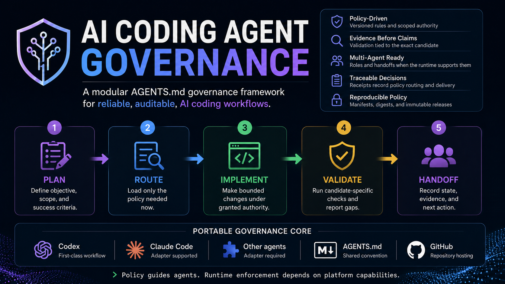

# AI AGENTS.md Governance



> **Current release line:** RC-3.0 (`3.2.0`).
> Immutable releases include the tracked source plugins, but bundling does not
> prove that any host installed, loaded, or activated those plugins.

> **Agent System identity:** [Read the canonical portable role contract](docs/agent-system-role.md).
> Its primary product is JIT Agent-file/rule discovery and smallest-sufficient
> scoped prompt composition. Agent-use enforcement is the necessary execution
> control; dependency-aware scheduling is a thin launch-order layer. Optional
> telemetry and defect/reporting support are secondary and never authority.

> **Public evidence philosophy:** Canonical Execution Evidence is a read-only,
> operator-requested projection of one private append-only evidence ledger.
> Coverage is never inferred where authoritative evidence is unavailable;
> governance records reality and does not manufacture it. Metrics remain
> downstream-only and never influence execution.

> **Incident and adoption contract:** Each bounded governance/runtime incident
> is privately appended to JSONL under a failure class. A persistent Agent
> System receives only new confirmed `agent_system` classes, material
> repair-advancing evidence, or true no-fallback P0/P1 core blockers; projects
> continue through fallback. After verified tracked edits are released and
> activated, known active project tasks receive one nonblocking exact-label
> reload/adopt notice before their next governed operation. The notice never
> retrofits hooks; app Reload is only needed for plugin/hook host refresh.

<!-- agent-kpi-overview:start -->

## Agent KPIs: Prove Multi-Agent Engineering Is Getting Better

> **Status: available and verified.** The optional local event and reporting layer is released. It is not the product contract; KPI history appears only after truthful lifecycle evidence is recorded.

Governance tells an agent how to work safely. **Agent KPIs answer the larger engineering question: is the Agent System helping people ship better software faster, with less waiting and less intervention?**

The primary view is a portfolio dashboard grouped by project, not by task. Any project using the Agent System can share one event model without embedding analytics in the project itself.

| Project | Delivery compression | Average seats | First-pass acceptance | Median operator wait | Operator interventions |
| --- | ---: | ---: | ---: | ---: | ---: |
| Project Alpha | Illustrative | Illustrative | Illustrative | Illustrative | Illustrative |
| Project Beta | Illustrative | Illustrative | Illustrative | Illustrative | Illustrative |
| Project Gamma | Illustrative | Illustrative | Illustrative | Illustrative | Illustrative |

### Four North-Star Metrics

1. **Delivery Compression**: estimated manual engineering hours divided by observed wall-clock hours.
2. **Parallelization Efficiency**: effective seat-hours divided by wall-clock hours times peak concurrent seats.
3. **Operator Load**: material approvals, interventions, redirects, and clarification requests required to reach a usable result.
4. **Autonomous Completion Rate**: work completed without intervention compared with work completed after intervention, restarted, abandoned, or blocked.

**Human Waiting Time** is the primary experience metric: elapsed time from starting a work item until the operator receives a usable result. **Manual Hours Avoided** is reported only as an engineering estimate with explicit coverage; missing estimates remain unavailable rather than being invented.

### Four Reporting Views

- **Portfolio dashboard:** the default 30-day view, grouped by project.
- **Project dashboard:** delivery, quality, agent efficiency, operator load, autonomy, and safety outcomes for each project.
- **Weekly trend:** whether compression, first-pass quality, waiting time, rework, and intervention are improving.
- **Task drilldown:** diagnostic detail for investigating a slow, restarted, blocked, or poorly decomposed execution.

### Analytics Must Never Govern Execution

```text
Kernel -> Receipts -> Events -> Metrics
```

Metrics consume existing lifecycle evidence. They never change policy, authorize an operation, influence a receipt, weaken a safety control, or become a completion gate. The KPI layer is optional and replaceable.

Telemetry is local and private by default. It records bounded lifecycle facts, identifiers, durations, outcomes, and estimates, not prompts, source code, model output, secrets, or hidden reasoning. Lifecycle writes are silent private JSONL. KPI and after-action reports are operator-requested only; run cleanup never sends them automatically.

Runtime transcript ingestion, when enabled by a host integration, is a separate
one-stream typed-family adapter. It reads only allowlisted `session_meta` and
`token_count` fields only after an exact project-root and/or task binding is
proved by session metadata. It projects per-turn `last_token_usage`, never
cumulative token snapshots, into the private append-only ledger; it never
writes the session or task source files. It cannot inject context, create
a handoff, send a task message, use the network, report automatically, or
change execution from a metric. See the [runtime telemetry contract](docs/agent-metrics.md#runtime-telemetry-ingestion-contract).

Efficiency trends use uncached input, output, and reasoning tokens per hour,
cache ratio over time, accepted work per hour, and accepted work per uncached
million tokens. Acceptance requires explicit evidence; missing values remain
`null` with coverage. Provider UI quota percentages and quota snapshots are
external operational diagnostics, never KPI denominators; only quota/UI
comparisons segment resets, while efficiency trends label material model,
rule-set, or runtime-accounting changes as regimes. See the
[efficiency contract](docs/agent-metrics.md#authoritative-efficiency-trends).

Older tasks do not automatically gain newly installed launch hooks through
reload. When a task is authoritatively confirmed as pre-hook, `acg context
adopt-current --operator-confirmed-pre-hook` returns the verified current
kernel, skill, role, release identity, and exact same-task load contract. The
task continues within existing authority using current policy and high-level
helpers; hook enforcement remains explicitly degraded. A fresh handoff is
required only when a major feature materially depends on launch-time
interception that the resumed runtime cannot prove, when old and current
contracts conflict materially, or only after the authoritative hosting runtime
rejects further context for capacity. A fresh task is never required because a
policy estimate is predicted not to fit; governance estimates never trigger
that handoff.
`context legacy` remains a deprecated alias.

See the [engineering metrics operator reference](docs/agent-metrics.md) for the
event and report commands, coverage rules, and scheduling boundary.

<!-- agent-kpi-overview:end -->

A compact, modular JIT orchestration and agent-use governance system for AI
coding agents.

The project keeps an always-loaded bootstrap at or below a 2,000 estimated
policy-token target and lazily loads specialist policies only when the
immediate operation requires them. A strict JSON manifest defines triggers,
dependencies, precedence, digests, and failure behavior. A package-free
Node.js router verifies that contract and returns compact receipts.

Agent System governs agent use and prompt activation. Project authority,
project state, release, deployment, publication, and business execution remain
with the project and operator. Agent System failure never blocks the project.

### Audience-specific communication

Human-facing chat, reports, status, decisions, operator handoffs, warnings, and
release summaries follow BLUF, the Pyramid Principle, progressive disclosure,
and plain-language design: answer first, concise reasons next, then proof.
Agent-to-agent messages are token-compressed, meaning-dense, and
loss-minimizing; they retain exact operational state and acceptance criteria.

This is an unofficial community project. It is not affiliated with or endorsed
by OpenAI, Anthropic, or another model provider.

## Compatibility

- Codex is the first-class integration: global `AGENTS.md`, a loader skill, and
  optional runtime plugins.
- Enterprise and custom agent harnesses can inject the kernel and call the same router.
- Claude Code can use the thin adapter in `adapters/claude/CLAUDE.md`.
- Other agents can integrate when their harness can load instructions and run
  the Node router.

The policy corpus and router are portable. Runtime-specific skills, plugins,
model attestations, and interception guarantees are not silently generalized
to runtimes that do not expose equivalent capabilities.

### Approval progression

Private evidence and local validation may inform a proposed change, but they do
not authorize publication. The explicit progression is **private immutable
evidence -> public beta -> public main**. Each transition requires its own
operator approval; no receipt, report, test, or metric substitutes for that
approval.

For native read-only quarantine attestation, `--agent` accepts either the
runtime UUID or the exact canonical collaboration task path (for example,
`/root/review-seat`). Nicknames, partial paths, ordering, and output style are
not identity evidence. This post-launch transcript binding does not prove host
activation, pre-launch interception, chained-action enforcement, or actual
reasoning identity.

If the host encrypts or otherwise withholds launch-message transcript content,
native envelope attestation fails closed: no current-host admission is implied
and actual model/reasoning remain Unverified. Close that quarantine seat and
continue the project through a permitted native fallback; do not treat the
attestation failure as project blocking.

The structured worker-envelope reference returned by `acg orchestrate next`
binds scope, non-authority, acceptance, stop conditions, validation, isolation,
evidence, return fields, requested model/reasoning, and fallback. It is not a
raw prompt, source snapshot, model output, hidden reasoning record, or project
authority grant. See [the public compatibility matrix](docs/compatibility.md).

For a composer-derived worker, use the no-guess launch path exactly:
`orchestrate next` -> `orchestrate launch --bundle <path> --seat <N>` -> pass
the returned `native_quarantine.spawn_request` verbatim -> attest -> send the
returned `admitted_assignment.message` verbatim as a new turn. Never construct,
summarize, reformat, or infer either native message.

The currently supported conservative Spark fallback is
`gpt-5.6-terra` at `low` only when the composer state is exactly
`unknown_or_unexposed` and `availability_evidence` is `Unverified`.
`authoritatively_unavailable` and `separate_pool_exhausted` are reserved
states. They fail closed at launch until a supported host capability receipt
provides authoritative availability evidence; an unverified claim of either
state is not permission to launch Terra.

## Architecture

- `governance/kernel/AGENTS.md`: always-loaded invariants and routing contract.
- `governance/modules/jit-orchestration.md`: detailed JIT rule-delta, Seat `0`,
  worker-prompt, native-recovery, consent, and KPI contracts.
- `governance/manifest.json`: deterministic module-routing authority.
- `governance/policy.lock.json`: digests for the kernel, skill, and modules.
- `governance/modules/`: specialist policies loaded only on an active trigger.
- `skills/govern-codex-policy/`: thin loader and rule-management interface.
- `bin/acg.mjs`: CLI argument parsing and output only.
- `lib/core.mjs`: canonical routing, validation, release, and receipt logic.
- `lib/seat-workflow.mjs`: intent-oriented assignment, recovery, and provenance.
- `.runtime/releases/`: immutable local runtime bundles.

`package.json` carries the governance system's semantic version. Runtime release
IDs such as `v1-<hash>` are immutable content identities, not semantic versions.
The human-facing release channel is recorded separately in both the package and
immutable release metadata.

### Stable-kernel principle

The kernel is a small, boring governance ABI: stable, predictable, versioned,
and rarely changed, with a target of no more than 2,000 estimated policy
tokens. Mature behavior belongs in routed modules, commands, diagnostics,
tests, and automation rather than additional always-loaded prose.

### JIT orchestration contract

For each immediate intent, Agent System discovers only the applicable
Agent-file/rule delta, retains prior policy in a monotonic context ledger,
composes the smallest sufficient worker prompt, and selects the lowest reliable
model/reasoning. Future roadmap operations do not trigger rules
early. Policy totals are advisory and never force compaction, rollover, or
handoff.

For substantial work, select `PARALLEL`, `PIPELINED`, `SERIAL`, or
`EXPLORATORY` from logical dependencies and integration contracts, not file
disjointness: isolated branches do not prove independent contracts. The default
delivery loop is **decompose -> reserve independent lanes -> isolated
branch/worktree per mutating worker -> worker implementation and local tests ->
Seat `0` integration -> authoritative final validation on the integrated
candidate**. Workers never merge, integrate, or touch the primary checkout.
Truly read-only workers need no new worktree; non-Git mutation uses equivalent
isolated mutable state. Worker contracts state the expected artifact, upstream
assumptions, validation, and integration order; shared-resource exclusions are
only for non-file mutable state such as schemas, migrations, lockfiles, ports,
databases, generated registries, or mutable fixtures.

Topology is JIT launch-order metadata, not broader context or a persistent
workflow state machine. Uncertainty yields `SERIAL` or `EXPLORATORY`; a
helper/classifier failure keeps delegation boundaries and uses a bounded
manual/native worker fallback without blocking the project.

Seat `0` owns orchestration, synthesis, acceptance, and reporting and is
excluded from the worker count. Its sole implementation exception is exactly
one explicitly atomic, low-risk, known-remedy correction, estimated before
mutation at no more than five AI-active minutes, where delegation overhead
dominates, only one source surface changes, and no worker-owned, contract,
security, privacy, dependency, migration, build, test, browser, deployment,
release, database, destructive, or authority-changing effect exists. An
explicit “Seat 0 does not implement” instruction removes that exception.

After an Agent System/helper failure, report or local-log unchanged evidence
once, then continue through any safe available path: another supported
high-level path, direct native collaboration, same-seat retry only after
changed conditions or a transient failure, a replacement or rescoped worker, a
bounded manual worker prompt, then project-native tooling. There is no hard
retry count and no unchanged relaunch loop. No fallback grants substantial
Seat `0` implementation or creates a wait-for-Agent-System state.

## Requirements

- Node.js 20 or newer
- Git
- A clean clone on its pushed default `main` branch to build a release

The implementation uses only the Node.js standard library.

## Human Installation

1. Clone the repository and enter it.
2. Run `npm test`.
3. Run `npm run verify`.
4. Run `npm run release:build`.
5. Copy the returned release ID.
6. Run `node bin/acg.mjs activate --release-id <release-id>`.

Activation installs stable links for Codex:

```text
~/.codex/AGENTS.md
~/.codex/policies
~/.codex/skills/govern-codex-policy
```

The runtime pointer changes only after the complete candidate validates. A
failed activation leaves the prior release active.

## Agent Setup Protocol

An installation agent must not guess machine paths or publish private settings.
Before first activation, ask the operator:

1. Where should the governance repository live?
2. Which exact repository and worktree roots are approved for each project slug?
3. Where should heavyweight generated output be stored?
4. Is there a separate review or export root?
5. Where may active model data be stored?
6. What continuity mode and location should each project use?
7. Is there a private organization or project-policy index?
8. Is global activation authorized now?
9. Should this installation create and maintain a persistent private task labeled `Agent System`? Task operation can consume tokens.
10. Should it automatically send that task bounded governance/runtime defect reports? Automatic reporting can consume tokens. If yes, use `log_only` or explicitly enable private Agent System `auto_correct`.
11. Should it automatically repair confirmed, locally actionable true Agent System blockers? Repair can consume tokens and requires reporting with the `auto_correct` disposition.
12. Which approval comfort level should Codex use: `ask`, `approve_for_me`, or `full`?

Approval levels:

- `ask`: confirm mutations and external effects.
- `approve_for_me`: continue authorized work automatically, including in-scope correction, retry, validation, and recovery; ask only before an unapproved irreversible action risking system-wide outage or data loss.
- `full`: add no confirmation inside authorized scope. Immutable safety and authorization boundaries still apply.

Write answers only to the untracked machine-local file:

```text
~/.codex/governance-machine-profile.json
```

Record the three Agent System decisions with the portable command; do not guess
profile keys or hand-edit the profile:

```text
node ~/.codex/policies/bin/acg.mjs profile agent-system --persistent-task yes|no --automatic-defect-report yes|no --automatic-repair yes|no [--reported-defect-action log_only|auto_correct] --acknowledge-agent-system-token-cost --authorize-profile-write [--label <exact-title>] [--memory <optional-private-file>]
```

`--memory` is optional machine-local continuity only. The tracked
`docs/agent-system-role.md` contract remains canonical.

`--reported-defect-action` is required with `--automatic-defect-report yes` and
rejected with `--automatic-defect-report no`. Legacy combined reporting consent
migrates to `log_only` and never authorizes automatic KPI or after-action
reports or automatic repair. Existing compatible callers that omit
`--automatic-repair` migrate that missing decision to declined; fresh
installations must make all three decisions explicitly. `log_only` records or
delivers one bounded defect and never starts repair.

Start from `fixtures/machine-profile.example.json`. Never commit the completed
profile, private policy indexes, organization overlays, project identities,
secrets, personal paths, or deployment targets.

Set the chosen level with:

```sh
node bin/acg.mjs profile approval --mode <ask|approve_for_me|full> --authorize-profile-write
```

After collecting answers, the installation agent must:

1. Validate all configured roots without creating content in them.
2. Run tests and source verification.
3. Build an immutable release from clean, pushed `main`.
4. Show the candidate release ID and semantic version.
5. Ask before first global activation unless the operator already authorized it.
6. Activate atomically and verify every stable link.
7. Report exact commands, release identity, validation, and unresolved limits.

## Normal Agent Use

Do not load all policy modules. Read the kernel and loader skill, classify only
the immediate operation, then use a documented high-level command when one
exists.

### Projectless generated read-only workspaces

For inspect-only work, explicit `--project null` means only the unbound
`projectless_unbound` sentinel, never a configured-project alias. It applies
only to a narrow generated directory with no overlap or ancestor/descendant
relation to a registered or sensitive root. A missing project, or `null` on a
non-inspect command, is invalid. Suppress only this expected unregistered-root
absence; do not change the machine profile or wait for recovery. Immediately
send a direct native read-only prompt with the exact directory and inspection
scope, accepting observations-only results with actual model/reasoning
`Unverified`. Registered or ambiguous binding, privacy denial, mutation, and
independent runtime defects remain governed and reportable.

For an audit:

```sh
node ~/.codex/policies/bin/acg.mjs audit \
  --project <project-slug> \
  --path <absolute-project-root>
```

The command performs route, delivery, and acknowledgment once. It returns the
minimum verified policy delta, including `delivered_modules[].content`, and an
`ACG_AUDIT_READY` sentinel. The acknowledgment becomes usable when the complete
output reaches the caller's context; it is not authoritative runtime evidence.
A future build, deployment, or subagent is not a current trigger.

Policy accounting is monotonic telemetry, not a context-window limiter. Tasks
keep their accumulated useful context as they evolve; estimated policy totals
never force compaction, rollover, handoff, or a fresh task. Only an
authoritative hosting-runtime capacity rejection can require a fresh task or
other context transition; an estimate that policy will not fit cannot.

Pass the prior context acknowledgment when policy has already entered the same
context:

```sh
node ~/.codex/policies/bin/acg.mjs audit \
  --project <project-slug> \
  --path <absolute-project-root> \
  --prior-receipt <complete-prior-output.json>
```

For a read-only delegated seat, use the intent command so neither the
coordinator nor child has to construct router lifecycle syntax:

```sh
node ~/.codex/policies/bin/acg.mjs seat inspect \
  --project <project-slug> \
  --path <absolute-project-root> \
  --seat <name> \
  --model <exact-model-id> \
  --reasoning <raw-reasoning-value> \
  --objective <bounded-read-only-objective>
```

The compact result contains one shell-free child `seat preflight` invocation,
an exact native quarantine spawn request, and one exact admitted assignment.
Pass each object verbatim at its documented lifecycle point; never rewrite the
quarantine message. Wait for the completed exact
`READY_FOR_NATIVE_ATTESTATION` response, attest, then send the admitted
assignment as a new turn. Accept only a result carrying its unique final
sentinel; a late completion without it belongs to the quarantine turn and is
not task output. The private package retains the bounded audit contract, fresh
child ledger, retry rules, and the exact integrity-validated admitted
assignment (message, final sentinel, stale rule, and close rule). If normal
output is truncated, use the returned package path directly with `seat explain
--assignment <package>` (or read its `admitted_assignment` object); do not
reconstruct, guess, or rerun the consumed attempt. Replacement seats use
`--attempt 2`.

For a user-authorized machine-root bootstrap:

```sh
node ~/.codex/policies/bin/acg.mjs profile add-root \
  --project <project-slug> \
  --path <absolute-project-root> \
  --authorize-profile-write
```

This dedicated command is the only routing-bootstrap exception. It validates
and atomically updates the private machine profile.

For a mutating seat, use an intent command rather than assembling router JSON:

```sh
node ~/.codex/policies/bin/acg.mjs seat assign \
  --project <slug> \
  --repository <absolute-repository> \
  --base <40-character-commit> \
  --seat <name> \
  --worktree-root <approved-worktree-root> \
  --write-scope <repository-relative-path> \
  --generated-scope <non-integrable-build-or-install-path> \
  --model <exact-model-id> \
  --reasoning <raw-reasoning-value>
```

Use `seat recover --assignment <governed-mutating-assignment-package>` to derive source, repository, base, scopes, model, and reasoning; it copies only current regular files within original write scope to a fresh worktree and reports excluded untracked out-of-scope paths neutrally. Recovery fails closed when a tracked out-of-scope path would be excluded. Use `seat continue` for the same seat's
expected owned dirty state and `seat finalize` to record final lineage. Its
closed `--intent` values are `implementation`, `validate`, and `deploy`; the
last routes and acknowledges deployment policy for the bound candidate, but
does not authorize source edits, Git commit/push, database mutation, or a
release claim. The
commands keep routing and receipts in a private assignment package; routine
operator reporting should state only readiness, progress, or a real blocker.
Each continuation also creates durable private provenance binding the project,
seat, worktree, original and continuation receipts, immediate intent, and
assignment-package integrity. `seat preflight`, `seat explain`, and `seat
finalize` fail closed if that provenance is absent or altered. A continuation
finalize uses its bound active receipt; an optional `--receipt` must identify
that same canonical filesystem object (so macOS `/var` and `/private/var`
spellings are equivalent), not another otherwise-valid continuation receipt.

Mutating `seat assign` returns one integrity-bound shell-free `child_preflight`
for `seat preflight --assignment <package>`. Pass it verbatim: it verifies the
assignment/worktree and owns the immediate implementation route, delivery, and
acknowledgment. The child must not construct raw router JSON or run another
governance command.

Seat `0` is the orchestrator and cannot receive a worker assignment. It may
directly implement one genuinely atomic, bounded correction only when estimated
before start at no more than five AI-active minutes and delegation overhead
dominates. Delegate work over five minutes, uncertain or multi-surface/risky
work, browser/build/test/deploy/validation execution, or an explicit or
established worker lane. Do not split or chain micro-edits to evade this rule;
if elapsed time or scope crosses five minutes, stop safely and delegate the
remainder. A stricter direct user or project instruction, including “Seat 0 does
not implement,” overrides this exception. Labels such as integration, recovery,
temporary output, or urgency do not change that effect-based boundary.
A missing or failed helper never grants Seat `0` implementation. Stop only the
affected action, report or local-log the defect once, and continue other safe
project work with existing tool definitions or native tools.
Generated scopes are declared up front, cannot overlap source write scope, and
are non-integrable; they are excluded from continuation payloads without walking
large generated trees. `seat finalize` records generated-output paths separately
from integrable source paths and rejects overlaps or paths outside both declared
scopes; generated files are not silently promoted into the source slice. Use the
high-level `seat recover` command; it derives project identity from the signed
assignment and remains bounded by its repository provenance.

Seat numbering starts with the orchestrator at `0`, but displayed agent and
seat counts include delegated workers only. A count of `2` therefore maps to
`0 orchestrator, 1 UI, 2 security`; delegated seats are numbered `1` through
the displayed count. Use `total participants` only when intentionally counting
the orchestrator too.

Operator visibility has three levels:

- Normal: task, owner, scope, status, meaningful changes, and result.
- Warning: blockers, scope conflict, authority denial, unsafe dirty state,
  failed proof, or model mismatch.
- Diagnostic: receipts, modules, routes, hashes, provenance, and accounting,
  returned only by `seat explain` or an explicit operator request.

Governance should be observable without being noisy. A normal operator can
supervise multiple seats without reading governance transcripts.

For material multi-phase work, updates appear at meaningful phase transitions,
blockers, estimate changes, validation milestones, completion, or a required
heartbeat. They include the current phase, a gate-derived percentage (or
`Unknown`), and an Estimated AI-active-time range. Substantial forecasts keep
conventional human P50/P80 effort separate from AI wall-clock, critical-path,
seat, validation, rework, and operator-time estimates. Forecasts are not
promises, telemetry, or completion gates.

## Agent System Defect Lane

The tracked [Agent System role contract](docs/agent-system-role.md) is the
canonical system identity. Private continuity can help a new instance discover
that contract and resume machine-local state, but it does not define the role.

An operator may configure the stable label `Agent System`. At report time,
project threads list current tasks, exclude archived tasks, and require one
exact title match. They use the runtime-returned thread ID only for that
delivery, never as the persisted routing key, because the operational thread
may change. Ambiguous matches fail closed. Project threads report or local-log
each unchanged governance/runtime defect once according to consent, preserve
project state, and immediately continue within existing authority using
existing tool definitions or native tools. There is no wait-for-Agent-System
state. Agent System may block an improper Seat `0` action, but it never blocks
the project. The Agent System task owns its own triage, repair, validation, and
authorized release lifecycle; a later response is not resume permission.

For an intentional replacement, stage the new task under a temporary
noncanonical title, then rename and unpin the predecessor, pin the replacement,
and only then assign the replacement the exact `Agent System` label. Verify one
non-archived exact match before sending reports. Pinning is a required
caller action in this workflow; topmost pinned placement is best effort because
ordering remains a host-runtime behavior.

KPI lifecycle events remain silent private JSONL. KPI and after-action reports
are generated only when the operator requests them. They cannot delay or reopen
completion, influence governance, transfer ordinary project ownership, or
create a wait state.

Automatic lookup, creation, and defect reporting require machine-profile
opt-in. A
fresh installation must ask the two separate decisions above before enabling
either capability; it does not silently create a task, send cross-task
governance messages, or spend background tokens. An absent,
undecided, or inactive consent is local-only: append one quiet, bounded,
secret-free entry to a private untracked JSONL issue ledger. That ledger is not
a message, never wakes or creates a task, and remains private. Agent System
continuity remains private and is never exported with this repository.

The persistent task is optional support, never a project dependency. Declining
or removing it leaves JIT rule selection, prompt composition, delegation,
native recovery, project-native tooling, and project completion available.
Only cross-task defect reporting disappears; local issue recording remains.

Enabled defect reporting requires `log_only` or `auto_correct`. Existing and
legacy combined configurations migrate to `log_only`; they never authorize
automatic KPI or after-action reports or automatic repair. `log_only` records
or delivers one bounded defect and never starts repair. In active reporting
mode, exact-label lookup, duplicate resolution, explicitly enabled auto-creation,
and immediate project continuation remain as described above. This contract
does not claim a background process or guaranteed host interception.

With `auto_report` enabled, a detecting project coordinator first records the
incident locally, then uses the returned eligibility to decide whether to send
one bounded report to the current non-archived exact-label task without another
operator prompt. It immediately continues project work. The local CLI returns
the private lookup contract but cannot invoke the host's task-message tool;
host-level automatic interception remains `Unverified` unless the runtime
attests it.

`auto_correct` is restricted to private Agent System code, configuration,
isolated worktrees, and private release lanes under existing authority. It
cannot mutate the reporting project, its continuity, or any public branch, and
it does not grant merge, push, activation, publication, or release authority.

Record every bounded incident locally before any possible cross-task message:

```text
node ~/.codex/policies/bin/acg.mjs agent-system record-issue --project <slug> --issue-id <id> --severity P0|P1|P2|P3|P4 --category agent_system|worker_adherence|host_runtime|project_tool_side_effect|caller_error|expected_fail_closed --failure-class <stable-slug> --summary <bounded-text> [--evidence-class Observed|Verified|Inferred|Proposed|Unknown|Unverified] [--evidence <bounded-text>] [--core-capability --locally-actionable --private-agent-system-scope --repair-authority --complete-exclusions --supported-fallback no] [--delivery-unavailable]
```

Active reporting uses the returned eligibility for at most one cross-task
message; disabled reporting remains local-only. `--delivery-unavailable` also
requires the explicit category and stable failure class, remains local, and
never starts a resend loop. A confirmed append-only reclassification to
`agent_system` may become eligible for one report, but the correction alone
never authorizes `auto_correct`.

The structured blocker-proof flags are optional because most incidents are not
repair candidates. For `auto_correct` eligibility, all six proof facts are
required: `--core-capability`, `--locally-actionable`,
`--private-agent-system-scope`, `--repair-authority`,
`--complete-exclusions`, and `--supported-fallback no`; the incident must also
be Observed/Verified and P0/P1.

## Claude Code Adapter

Add one line to a private user or project `CLAUDE.md`, replacing the path with
the absolute clone location:

```text
@/absolute/path/to/ai-agentsmd-governance/adapters/claude/CLAUDE.md
```

The adapter imports the kernel and loader skill, not every specialist module.
Codex-only plugin enforcement remains unavailable unless the hosting harness
provides an equivalent interception tool.

## Adding or Changing Rules

Use the `govern-codex-policy` skill. It resolves one canonical owner, checks for
duplicates and contradictions, compresses wording without weakening it,
regenerates digests, validates the policy tree, and applies the required
semantic-version bump. Machine-local requests are recorded in an untracked
JSONL ledger.

Do not duplicate global rules in project files. Do not promote private
organization or machine policy into the public source tree.

## Public-Safety Boundary

The tracked distribution must contain no personal paths, operator profiles,
private organization policies, confidential overlays, secrets, or local
deployment state. Those surfaces are ignored by default and remain local.

Before publishing a distribution, scan both tracked files and generated release
metadata. A clean public export should be created from tracked files only, with
new history rather than private development history.

Normal feature pull requests target `beta`, not `main`. CI runs on pull
requests into `beta` and on pushes to both `beta` and `main`.

Public beta candidates normally soak until Friday before stable promotion.
Promotion may occur earlier on operator direction. This documents a release
cadence; it does not create an automatic scheduler.

## License

No license is granted until a license file is added. Source visibility alone
does not grant permission to reuse or redistribute the project.
